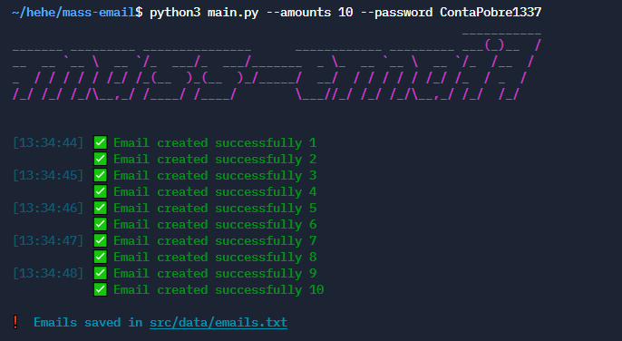

# 📧 Mass-Email

<div align="center">
    
</div>

<br>

<p align="center">
    
    
    
    
</p>
#### 📧 Bulk temporary email generator using [mail.tm](https://mail.tm/) services.
<br>

## ⚡ Installing / Getting started

<p> A quick guide of how to install and use. </p>

```
1. Clone the repository - git clone https://github.com/w1res/mass-email.git
2. Install the libraries - pip3 install -r requirements.txt
3. Run - python3 main.py --amounts AMOUNTS --password PASSWORD
```

### ⚙️ Pre-requisites
- [Python 3](https://www.python.org/downloads/) installed on your machine.
- Install the libraries with `pip3 install -r requirements.txt`

## Usage
```
                                                              ___________
_______ _________ _______________      ____________ _________ ___(_)__  /
__  __ `__ \  __ `/_  ___/_  ___/_______  _ \_  __ `__ \  __ `/_  /__  / 
_  / / / / / /_/ /_(__  )_(__  )_/_____/  __/  / / / / / /_/ /_  / _  /  
/_/ /_/ /_/\__,_/ /____/ /____/        \___//_/ /_/ /_/\__,_/ /_/  /_/   


usage: main.py [-h] -a AMOUNTS -p PASSWORD

Bulk email generator

options:
  -h, --help            show this help message and exit   
  -a AMOUNTS, --amounts AMOUNTS
                        Desired amount of generated emails
  -p PASSWORD, --password PASSWORD
                        Email password
```
> NOTE: Number of emails and password is required.

> Saved email format: michaelmarshall37990@candassociates.com|ContaPobre1337

### ⚠️ Warning
- The developer is not responsible for any malicious use of this tool.
